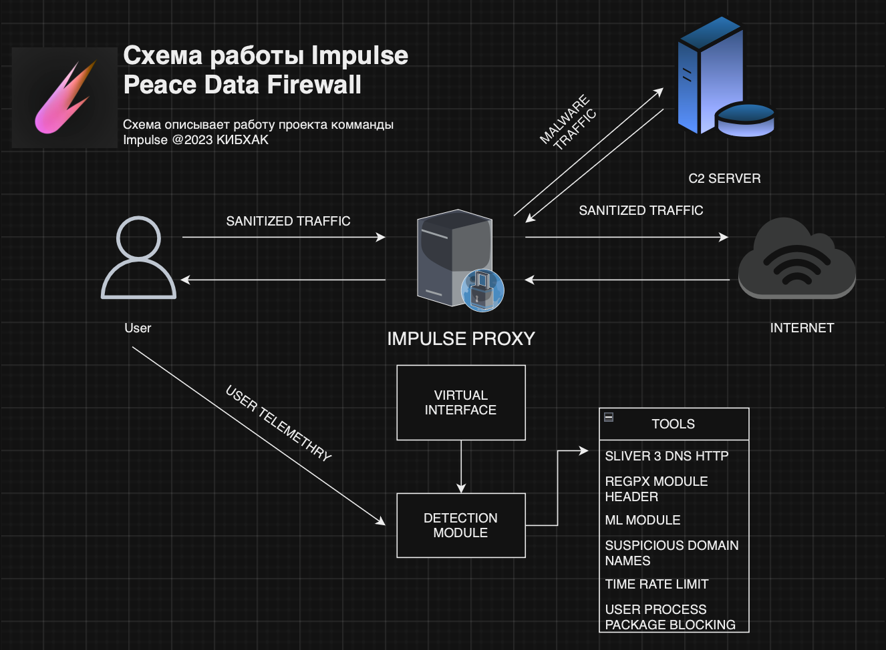

# Impulse PeaceData Firewall

Impulse PeaceData Firewall - это решение для мониторинга, захвата и модификаии трафика, основонного на кастомных правилах поиска C2 нагрузок.
Или предвещающих данную эксплуатацию факторах.

## Авторы проекта
````
- Иорин Давид 
- Морозов Андрей
- Беляев Иван
 ````
Проект сделан в рамках хакатона КИБХАК @2023 и носит исследовательский характер.

## Проблематика 
Обнаружение C2 трафика в сети сложно из-за использования шифрования, постоянно меняющихся IP и доменов, а также из-за злоумышленников, которые маскируют свои коммуникации под легитимный трафик, используя обычные сервисы и протоколы. Также проблему представляет разнообразие вредоносного ПО, которое может изменять своё поведение, что затрудняет создание эффективных средств обнаружения.


## Архитектура

 Основные компоненты системы:
- ** Pure Python3.10
- ** MITMProxy interface
- ** Pcap File Analyzer
- ** Real-Time Traffic Filter
- ** Sliver CS payload Detector

## Описание Архитектуры
- ** Impulse Proxy
  -Представляет собой mitmproxy интерфейс на порте 8080 через который идет трафик. Без правил обработки скорость падает на 5-7% от пиковой производительности:
  ````
  100
  ````

- **Пользователь**: Взаимодействие с системой через прокси.
- **Прокси 9999**: Слушает порт 9999 и перенаправляет трафик.
- **Уровень**: Механизм управления прокси.
- **Интерфейс**: Позволяет взаимодействовать с прокси.
- **Телеметрия Процесса**: Сбор данных о работающих процессах.
- **Модуль Обнаружения**: Анализирует данные от телеметрии процесса.
- **Облако**: Облачная инфраструктура для обработки данных.
- **C2-Сервер**: Управляющий сервер в облаке.

## Инструменты и Модули

Перечень инструментов и модулей, используемых в проекте:

- **Tool/Bot**: Автоматизированный инструмент для взаимодействия с C2-сервером.
  - detectpe go
  - PPT analysis
  - ML module
  - Reports
  - Web
  - Admin
- **VirusTotal**: Интеграция с VirusTotal для проверки файлов и URL.


